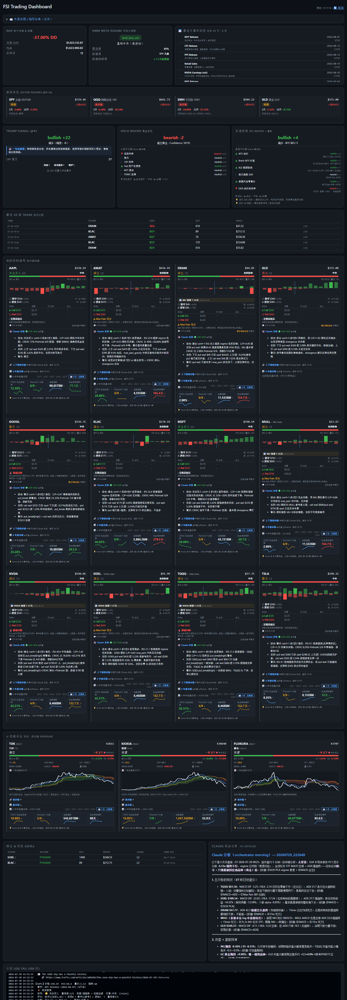
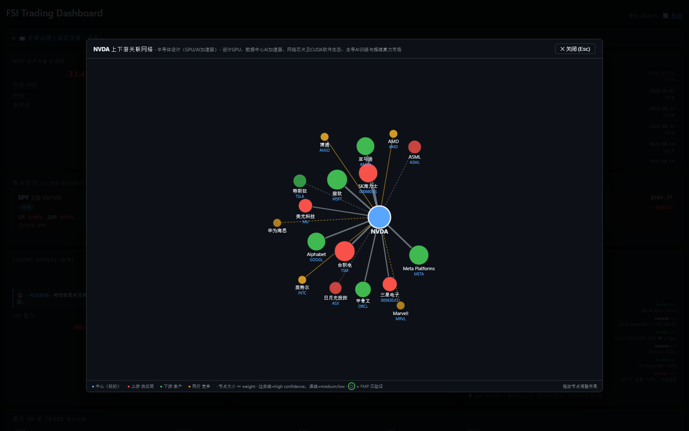
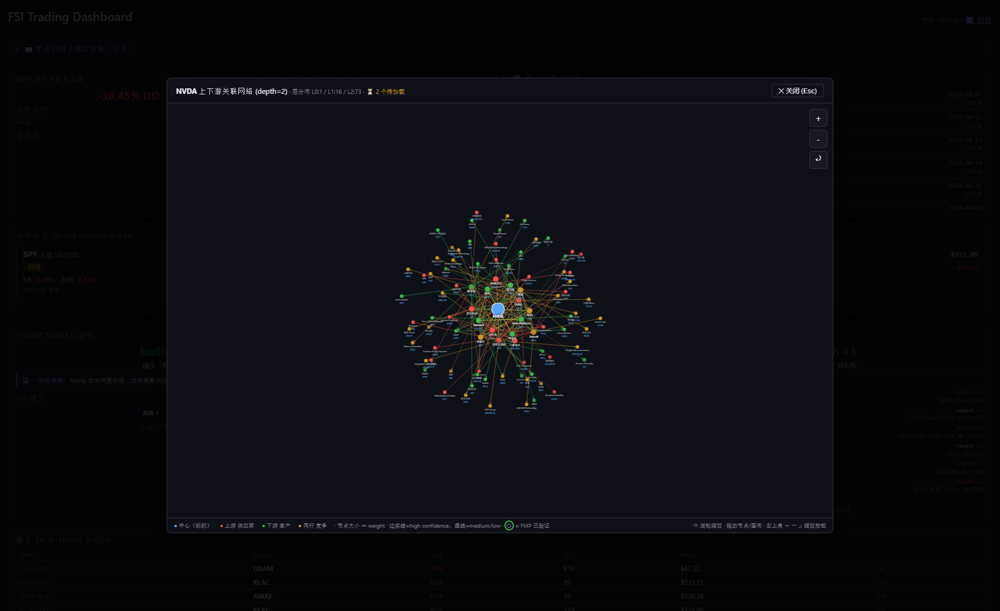

# fsi-skills Trading Agents

[](LICENSE)
[](https://www.python.org/)

**语言 / Language**：[English](README.md) · **简体中文**

多策略量化信号 + Claude CLI 综合解读 + moomoo 模拟仓自动下单系统。

针对 **TQQQ / SOXL / DRAM / MULL / GLD** 等核心 ETF，日 K 主信号 + 15min K 辅助，结合
进化规则共振、Trump Truth Social 实时解析、黄金宏观因子、期权 gamma 盯盘，给出可操作
决策并通过 paper_trader 在 moomoo SIMULATE 账户落地。

## Dashboard 预览

WebUI（`webui.bat` → http://127.0.0.1:8080）— 零依赖 http.server + 单页 dashboard，
覆盖 NAV / 板块 regime / Trump 情绪 / 黄金+石油宏观 / 事件日历 / 每标的信号 + 期权墙 + Claude 分析。



**每张标的卡包含**：多空共振条 + 建议动作/置信度 → 迷你 **期权墙 SVG**（call/put 成交分布 + spot 虚线 + Max Pain）→
**攻防位表格**（strike / 保费 / OI 仓位 / 名义敞口）→ **挤压风险**（gamma_up / put_break / max_pain_gravity）→
**C/P 比 + 小白解读**（Put 远大于 Call 时区分 ATM 恐慌 vs OTM 保险）→ **🤖 Claude 即时分析**
（3 行结构化：综合 / 攻防 / 警示，10 只标的全覆盖，缓存 by 数据 hash）→ **🔗 上下游供应链**
（Claude 生成 upstream/downstream/peers + confidence 标记 + 可选 FMP peers 交叉验证，懒加载缓存 7 天）。

**🕸 D3 蜘蛛网全图**（Bloomberg SPLC 风格）：每张卡供应链区右上角「🕸 1 层 / 2 层」按钮 —
- **1 层**：直接邻居（快，用本地 cache）
- **2 层**：BFS 展开 2 跳（NVDA depth=2 = 90 节点 / 233 边）—— 下游公司的下游、上游的上游都出来
- 边颜色：🔴 supply / 🟢 customer / 🟡 peer；宽度 ∝ weight；实线=high confidence，虚线=medium/low
- **边 hover 显示理由**（例：`TSM → NVDA · 供应关系 · 独家代工 H100/H200/B100/B200 先进制程 GPU`）
- FMP 验证过的 peer 有绿色圆环
- 可拖动节点重排布局，Esc / 点击遮罩关闭
- URL 直达：`?graph=NVDA&depth=2`

**1 层示例（NVDA）**：

**2 层示例（NVDA 深度扩展）**：

**📊 4 年基本面（財報狗风格）**：每张卡新增折叠面板，4 个免费指标（yfinance 拉，30 天缓存）：
- **CROIC 现金回报率** — FCF ÷ Invested Capital，>10% 健康 / >20% 摇钱树
- **Piotroski F 分数** — 9 项财务打分，7-9 强 / 4-6 普通 / 0-3 警示
- **金融借款** — ST + LT debt，连年上升 = 杠杆放大
- **现金周转循环** — DIO + DSO - DPO，越短越好，>120 天警惕库存压力
- 每格：最新值 + 涨/跌箭头 + 4 年 SVG sparkline + hover 用途解释
- ETF 用代表单股（TQQQ/SOXL → NVDA / DRAM/MULL → MU）；GLD 跳过
- **Claude 分析里也会引用**（发现 CROIC 骤跌 / 借款激增 / Piotroski<4 时会主动警示）

**🔥 大单高亮 + 财报结合**：
- 期权 wall 的 OI ≥ 5K 手 或 名义敞口 ≥ $30M → 攻防位表格显示 🔥，迷你 SVG 图的柱子加深填充 + 顶部 🟠 圆点
- 「异常成交」（当日 vol > 0.5 × OI）→ hover 显示 ⚡
- 每张卡 attack/defense 面板顶部新增 **📅 财报徽章**（关联财报股 + T-N 天 + 隐含波动 ± IM%）
  - MULL/DRAM ← MU 财报；SOXL/TQQQ ← NVDA 财报
  - T ≤ 3 天 🚨 红色 / T ≤ 14 天 ⚠ 黄色 / T ≤ 60 天 📅 灰色
  - 期权到期日跨财报时标注「含财报风险」

**顶部**：📅 最近 45 天事件日历（FOMC / CPI / NFP / NVDA 财报），带小白 hint 说明每种事件对市场的影响。

**展开全部详情视图**：`?expand=all`（用于 README 截图 / 一览分析）— [见 dashboard-full-expanded.png](docs/dashboard-full-expanded.png)

## 主要特性

- **Regime 单一源** — pre-open 算定 → 全系统读单一源，禁止多处独立检测
- **回测门控** — 任何信号/决策改动必须跑 `_backtest_modules_accuracy.py` 等回测脚本，hit rate 不退化才合并
- **新闻 CLI 化** — RSS / Truth Social 不直接 keyword 匹配，先调本地 Claude CLI 拆为结构化 JSON 再消费
- **多模块准确率** — 250 天历史回测，quant（进化规则）20d hit rate 70-78%（SOXL/MULL 等）
- **三巫日识别** — 自动识别每季 3/6/9/12 月第三周周五，GEX 代理 + 关联财报提示
- **Claude AI 目标价** — Claude 输出结构化 JSON（entry_ref / stop_ref），paper_trader 自动挂限价 + SELL STOP

## 标的列表（[`agents/config.py`](agents/config.py)）

| Ticker | 类型 | 杠杆 | 备注 |
|---|---|---|---|
| TQQQ | NDX 杠杆 ETF | 3x | 科技多头主仓 |
| SOXL | SOX 半导体 杠杆 ETF | 3x | 半导体多头 |
| DRAM | Roundhill Memory ETF | 1x | 存储芯片板块（Micron + SK Hynix + Samsung 暴露）|
| MULL | Micron 杠杆 ETF | 2x | DRAM/NAND 龙头单股 |
| GLD | 黄金 ETF | 1x | 避险 / 宏观对冲 |

## 快速开始

```cmd
:: 1. 安装依赖（首次）
cd f:\fsi-skills\agents
setup.bat

:: 2. 配置 secrets（首次）
copy secrets.example.json secrets.local.json
:: 编辑 secrets.local.json 填入 FRED_API_KEY 和 MOOMOO_ACC_ID
:: ⚠ secrets.local.json 已在 .gitignore，永远不要 commit — 详见 SECURITY.md

:: 3. 启用 pre-commit 安全钩子（首次）
git config core.hooksPath .githooks
:: 拦截 sk-... / ghp_... / AKIA... 等常见 secret 意外 commit

:: 4. 启动 moomoo OpenD（一直开着）

:: 5. 选择运行模式
run.bat        :: 长跑（orchestrator，每 5min 检查 + 5 个 ET 窗口）
snap.bat       :: 一键当日快照（regime + Trump + 信号 + 期权 + Claude 解读）
tools.bat      :: 工具菜单（trader status / regime / picks / flatten 等）
backtest.bat   :: 回测菜单（regime / news / trump / modules / V-bounce）
trump.bat      :: Trump signal 单独查
weekly.bat     :: 周末跑一次模块准确率回测，刷 signals/module_accuracy.md
```

## 配置文件

| 文件 | 用途 | 是否入 git |
|---|---|---|
| [`agents/config.py`](agents/config.py) | 公共配置：TICKERS / 杠杆系数 / 时间窗口 / 阈值 | ✅ |
| [`agents/secrets.example.json`](agents/secrets.example.json) | 敏感配置模板（占位） | ✅ |
| `agents/secrets.local.json` | **真实** FRED_API_KEY / MOOMOO_ACC_ID 等 | ❌（.gitignore） |
| `.claude/settings.local.json` | Claude Code 权限白名单 | ✅ |
| [`SECURITY.md`](SECURITY.md) | 敏感信息管理规则 / pre-commit hook / 漏洞报告方式 | ✅ |
| [`.githooks/pre-commit`](.githooks/pre-commit) | 拦截误 commit 的 API key（`git config core.hooksPath .githooks` 启用） | ✅ |

## 入口脚本

- [`run.bat`](agents/run.bat) — orchestrator 长跑，5 个 ET 窗口（08:30 / 09:20 / 10:00 / 12:00 / 15:45）自动触发
- [`snap.bat`](agents/snap.bat) — 一次性快照，含 regime / Trump / 三巫日 / 信号 / 决策 / 事件日历 / Claude 综合解读
- [`tools.bat`](agents/tools.bat) → [`tools_menu.py`](agents/tools_menu.py) — 交互菜单
- [`backtest.bat`](agents/backtest.bat) → [`backtest_menu.py`](agents/backtest_menu.py) — 回测菜单
- [`trump.bat`](agents/trump.bat) — 仅看 Trump signal banner
- [`weekly.bat`](agents/weekly.bat) — 一键刷 module_accuracy.md（周末跑）

## 系统架构（数据流）

```
                        ┌─── moomoo OpenD（实时 quote + paper 下单）
                        │
   FRED ────┐           │      ┌─── Trump signal (CNN truth_archive)
            ├── data_feeds + market_watch ──┤
   yfinance ┘           │      └─── 期权链 (yfinance options)
                        │
                        ↓
            [Block 1-11 信号采集层]
                        ↓
   regime_today.py（pre-open 单一源）
                        ↓
   ┌──────────────────────────────────────┐
   │ decision_agent._etf_rules /          │
   │ _gold_rules → action + conf + stop_ref│
   │ (含 V 反弹 / Trump override / 事件分级)│
   └──────────────────────────────────────┘
                        ↓
   claude_gate.py（下单前二审；run.bat 默认失败关闭）
                        ↓
   ┌──────────────────────────────────────┐
   │ paper_trader.execute() 7 层下单链：    │
   │  ① 窗口门槛 → ② 纪律性管理 → ③ 去重    │
   │  ④ action 分流 → ⑤ vol-target 仓位     │
   │  ⑥ 限价组装 → ⑦ moomoo SDK 提交       │
   └──────────────────────────────────────┘
                        ↓
                  moomoo SIMULATE 账户

   ＊ Claude CLI 报告解读层（不在下单链，与上面的二审 gate 分开）：
     run_cycle 完成后调 Claude CLI 综合 11 个 block
     输出 700-1000 字人话报告 + 结构化 JSON 目标价
     paper_trader 下一个 cycle 会读 JSON 调整限价/止损
```

## 信号模块（Block 编号供 Claude 依据标注）

| # | 模块 | 文件 |
|---|---|---|
| ① 基础报告 | [`report_generator.py`](agents/report_generator.py) |
| ② 规则进化 | [`strategy_evolver.py`](agents/strategy_evolver.py) |
| ③ 胜率排行 | [`strategy_engine.py`](agents/strategy_engine.py) `generate_pattern_leaderboard` |
| ④ 信号实况（共振） | [`confluence.py`](agents/confluence.py) + [`market_watch.py`](agents/market_watch.py) |
| ⑤ 事件日历 | [`events_watch.py`](agents/events_watch.py) |
| ⑥ Trump signal | [`trump_signal.py`](agents/trump_signal.py) |
| ⑦ 期权墙 | [`option_walls.py`](agents/option_walls.py) |
| ⑧ MACD + ADX | [`market_watch.py`](agents/market_watch.py) |
| ⑨ SOX PCA | [`pca_sox.py`](agents/pca_sox.py) |
| ⑩ 黄金宏观 | [`gold_macro.py`](agents/gold_macro.py) |
| ⑪ 期权风险（三巫日 / GEX / 关联财报）| [`option_walls.py`](agents/option_walls.py) `get_options_risk_signal` |

## 决策模块

| 文件 | 作用 |
|---|---|
| [`agents/decision_agent.py`](agents/decision_agent.py) | 规则引擎：`_etf_rules` / `_gold_rules` 出 action + conf + stop_ref |
| [`agents/regime_today.py`](agents/regime_today.py) | regime 单一源（pre-open 写 regime_state.json）|
| [`agents/paper_trader.py`](agents/paper_trader.py) | moomoo SIMULATE 下单 + 仓位管理 + 止盈止损 |
| [`agents/quant_signal.py`](agents/quant_signal.py) | 进化规则共振打分 |
| [`agents/ai_prompt.py`](agents/ai_prompt.py) | Claude CLI 调用 + prompt 模板 + 结构化 JSON 解析 |
| [`agents/claude_gate.py`](agents/claude_gate.py) | Claude 二审 gate（pre-trade approval）|

## 回测

| 脚本 | 验证什么 |
|---|---|
| [`_backtest_modules_accuracy.py`](agents/_backtest_modules_accuracy.py) | 各模块 × 1d/5d/10d/20d hit rate（基础回归测试） |
| [`_backtest_regime_fix.py`](agents/_backtest_regime_fix.py) | regime 单一源改动前后决策一致性 |
| [`_backtest_news_pipeline.py`](agents/_backtest_news_pipeline.py) | CLI 解析 vs keyword 法（事件落地判断准确率） |
| [`_backtest_trump_signal.py`](agents/_backtest_trump_signal.py) | Trump 信号方向命中率（vs trump-code baseline） |
| [`_backtest_v_bounce.py`](agents/_backtest_v_bounce.py) | V 反转追买（杠杆 ETF 5d/10d/20d） |
| [`_backtest_gold_macro.py`](agents/_backtest_gold_macro.py) | 黄金宏观信号注入回测 |
| [`backtest_engine.py`](agents/backtest_engine.py) | Lite / Mid / Heavy 三档全系统回测 |

回归测试（在 `agents/` 目录运行）：`python -m unittest discover -s tests -v`

输出报告：[`agents/signals/module_accuracy.md`](agents/signals/) （注：实际文件被 gitignore 排除）

## 备份

- 大改动前：`python _make_backup.py` → `backups/agents_backup_<时间戳>_with_AB.zip`
- 重要里程碑：`git tag v0.x.x && git push --tags`

## 已知限制

- 不提供实盘交易（仅 moomoo SIMULATE 账户）
- DRAM ETF 上市 < 60 天，进化规则未训练，仅 decision 主流程有效
- Claude CLI 调用延迟 30-60s，每天 ≤30 次（额度可控）
- 不付任何 API key — 全部用 FRED 免费 + yfinance + Claude Code 订阅 CLI

## Changelog

每个 tag 对应的主要变更。详细 diff 见 [GitHub Releases](https://github.com/zzwjlwwdtg/fsi-skills-agents/releases)。

### [v0.3.0](https://github.com/zzwjlwwdtg/fsi-skills-agents/releases/tag/v0.3.0) — 2026-07-28

**大版本**：15 项系统能力升级 + 主动推送 + WebUI + 开源就绪

**新功能（15 项 checklist 落地）**：

- **P1 观察层**
  - [`docs/EDGE.md`](docs/EDGE.md) 明确系统 edge 来源、伪 edge、非 edge
  - [`_benchmark_report.py`](agents/_benchmark_report.py) NAV vs SPY/QQQ 周报（Sharpe/Max DD/α）
  - [`_trade_postmortem.py`](agents/_trade_postmortem.py) BUY/SELL 配对 + P&L 归因
- **P2/P3 风控 + 仓位**
  - 相关性组仓位上限（`tech_3x` 50% / `tech_2x` 30% / `single_high_beta` 30% 等 6 组）
  - Probe 试探仓位（低 conf = 30% 仓位）+ 金字塔加仓（≤3 层）
  - Half-Kelly 仓位微调（min 10 trades，cap [0.5, 1.5]）
- **P4 决策/时序**
  - Sitting 强制确认期（持仓 < 3 天信号 SELL 不放行）
  - 连续亏损暂停（3 笔连亏 → 24h 停开新仓）
  - HMM meta-regime 单向收紧（volatile/crisis/bear → bull_thresh +1，绝不放宽）
  - **反向 ETF OOS 拒绝**：SQQQ/SOXS 触发后 5d 上涨率仅 26.5%（-33pp 反指标）→ 不上线
- **P5 基础设施**
  - `TRADER_LIVE_FRACTION` env var 灰度切换（0.0-1.0）
  - [`_data_source_health.py`](agents/_data_source_health.py) 数据源体检
- **主动推送** [`notifications.py`](agents/notifications.py)
  - Discord webhook + Telegram bot 双通道（有哪个用哪个）
  - 5 分钟 dedup 防刷屏
  - Hook 点：trade 成交 / crisis regime / watchdog 死机重启 / 连续亏损暂停
- **WebUI Dashboard**（零依赖 Python 自带 `http.server`）
  - [`webui.py`](agents/webui.py) 8 个 API 端点（health/nav/positions/trades/log/hmm/signals/banners/ai_analysis）
  - [`dashboard.html`](agents/dashboard.html) 单页 SPA + Chart.js + marked.js
  - NAV 时序图 + 每标的信号卡（bull/bear 共振条 + regime 徽章）+ HMM 状态 + Trump/Gold Macro 卡片 + Claude 分析 markdown 渲染
  - 30s 自动刷新，仅绑 127.0.0.1
  - [`webui.bat`](agents/webui.bat) 启动
- **Watchdog + 自动重启** [`_watchdog.py`](agents/_watchdog.py)
  - Windows Task Scheduler 每 30 分钟检查 orchestrator PID
  - 死了自动清 stale lock + 用 pythonw 静默重启（无窗口）
- **开源就绪**
  - MIT [`LICENSE`](LICENSE)
  - [`SECURITY.md`](SECURITY.md) 敏感信息管理
  - [`.githooks/pre-commit`](.githooks/pre-commit) 拦截 sk-/ghp_/AKIA 等 secret 模式
  - `.gitignore` 加固 `.env.*` / credentials / pem / id_rsa
- **回测科学化**
  - OOS 验证成为硬门槛（14 OOS 标的样本 ≥ 30，5d edge ≥ 8pp 才上线）
  - `_backtest_overheated_oos.py` / `_backtest_divergence.py` / `_backtest_trend_capture.py` / `_backtest_inverse_etf.py` 全套 OOS 验证脚本

**关键 bug 修复**：

- **conf_min 未按 /5 量程缩放** — TECHNICAL_ONLY 下所有信号被静默跳过（fix `conf_min * scale/10`）
- **A+B / C 方案回滚** — OOS 证实 CAUTION 层 + overheated 多日累积 + 顶背离 均为反指标（-14~17pp）
- **.bat 中文 REM 在日语 CP932 下解析错乱** — 全部 ASCII-only
- **LOG_PATH 跨午夜不切** — 加 `_DailyLogHandler` 自动切文件

**新记忆**：

- [feedback_technical_only_mode.md](memory) 消息面仅 banner，不进决策评分
- [feedback_oos_required.md](memory) 训练集 N≤5 立 hard rule 是过拟合
- [feedback_bat_ascii_only.md](memory) .bat 中文 REM 会让日语 cmd 误解析

### [v0.2.1](https://github.com/zzwjlwwdtg/fsi-skills-agents/releases/tag/v0.2.1) — 2026-06-23

财报期权隐含 move 屏蔽 + 跨午夜日志切换

- **新增** [`option_walls.get_earnings_implied_move(stock)`](agents/option_walls.py)：读财报当周 ATM straddle 算 implied ±%（含 ATM±1 smoothed）+ C/P vol ratio + IV
- **新增** [`decision_agent._apply_earnings_guard()`](agents/decision_agent.py)：按 `leveraged_im = im × ETF leverage` 分档屏蔽
  - `> 20%` → 强制 HOLD；`12-20%` → conf-3（<6 降 HOLD）；`6-12%` → conf-2；T-1/T-0 一律 HOLD
- orchestrator 每 cycle 注入 `events.earnings_implied_move`（MU/NVDA 等关联股 30 天内）
- 回测 ([`_backtest_earnings_implied_move.py`](agents/_backtest_earnings_implied_move.py))：MU 5 年 20 次财报，MULL 实测 beta=2.08x（验证设定）；MULL |move|>20% 概率 25%；2024-12-18 MULL 单日 -32.74%
- 实战：MU 6-25 财报，MULL/DRAM `WATCH_BUY` 自动降 HOLD
- **bug 修复**：[`config.LOG_PATH`](agents/config.py) 跨午夜不切——新增 `get_today_log_path()` + [`notifier._DailyLogHandler`](agents/notifier.py)，emit 时按当天日期切换文件

### [v0.2.0](https://github.com/zzwjlwwdtg/fsi-skills-agents/releases/tag/v0.2.0) — 2026-06-22

JP Social Reco 接入 + Block ⑫

- 接入 [`jp_social_reco`](agents/jp_social_reco/) 子系统到主框架（snap.bat / orchestrator / Claude prompt）
- 新增 `get_jp_social_with_backtest()`：信号 + 创作者历史胜率 + ticker 按 horizon 回测命中
- 新增 `format_jp_social_banner_enhanced()`：含星标 / thesis / 风险 / 时间维度 / 创作者胜率 / 回测命中
- Claude prompt 加 **block ⑫** JP 博主推荐，要求 ≥★★★ 标的必须列入早盘可参考清单
- 星标算法（按 mentions × creators 数）：★★★★★ / ★★★★ / ★★★ / ★★ / ★
- bug 修复：price_check 字段附加方式 + creator_accuracy 取 creators list

### [v0.1.0](https://github.com/zzwjlwwdtg/fsi-skills-agents/releases/tag/v0.1.0) — 2026-06-21

初始版本

- Regime 单一源（pre-open 算定 + -5% crisis override）
- 5 标的：TQQQ / SOXL / DRAM / MULL / GLD
- 进化规则共振 + module accuracy 250d 回测（quant 20d 70-78%）
- Trump signal CLI 解析（80% hit rate vs trump-code baseline）
- 黄金宏观（real_rate + DXY + WALCL + FOMC + oil + 10Y）
- 期权盯盘（Call/Put Wall + Max Pain + GEX + 三巫日 + 关联财报）
- V 反弹追买（1x WATCH_BUY / 杠杆 LONG_HOLD 分流）
- 事件分级（CPI/FOMC/NFP critical, PCE/PPI/Retail high, 财报 moderate）
- Claude CLI 综合解读 + 结构化 JSON 目标价（A 方案）
- decision_agent 自动算 stop_ref（B 方案）→ paper_trader 挂真实 SELL STOP
- ticker prefix bug 修复（_scaled_pct 兼容 "SOXL" 和 "US.SOXL"）
- trump_score 方向不对称（bullish 不加 risk）
- 7 层 vol-target 下单链
- Secrets 隔离到 agents/secrets.local.json（gitignore）

## License

私有项目，未授权不得分发。

## 相关项目

- [`F:\trump-code`](F:\trump-code) — Trump Truth Social 推文 → 美股信号回测，本系统的 trump_signal 模块借鉴其关键经验

## 维护

主要 memory 在 `C:\Users\masa\.claude\projects\f--fsi-skills\memory\` 下：
- `feedback_trading_style.md` — 用户偏好（追高强趋势 / 指标三档 / CMD 不用 markdown 等）
- `feedback_regime_first.md` — Regime 单一源原则
- `feedback_backtest_gate.md` — 任何改动必须回测验证
- `feedback_news_pipeline.md` — 新闻进入系统前必须 CLI 拆为结构化 JSON
