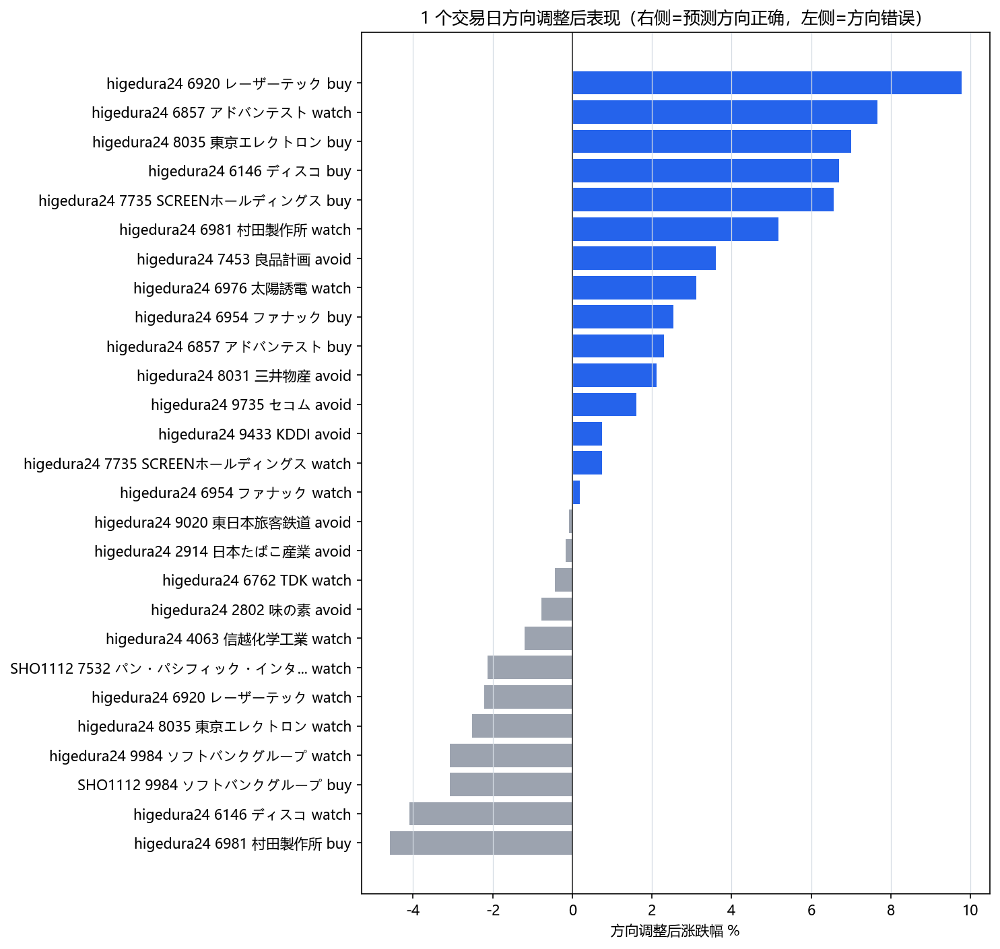
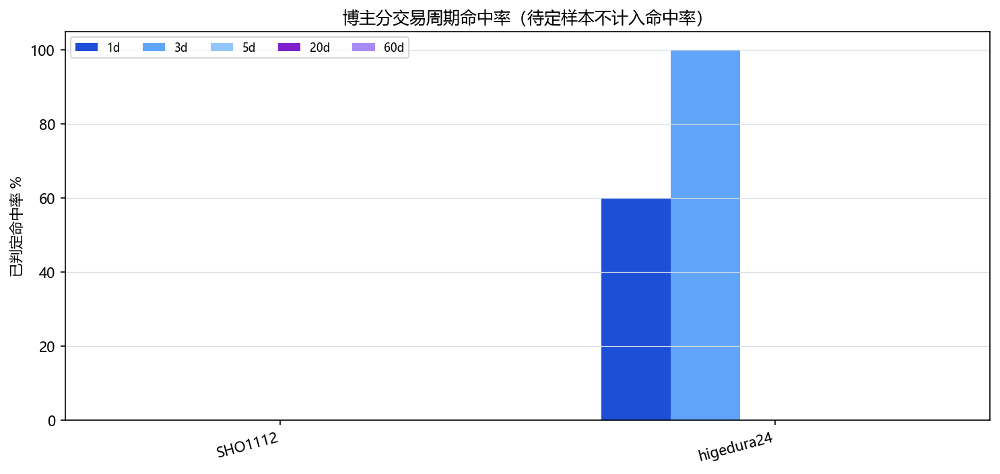

# 日股博主近一周总结

## 核心结论

近一周（2026-06-09 至 2026-06-16）共采集 21 条素材、27 条建议，主要来自 higedura24 与 SHO1112 两位日股博主。整体方向偏多，焦点几乎全部集中在 **AI 半导体设备链** 与 **MLCC 电子零部件**，并伴随一组 **内需防御股的资金流出（avoid）** 观点。aggregate_score 排序最高的依次为：ファナック（6954）、ソフトバンクグループ（9984）、アドバンテスト（6857）、村田製作所（6981），随后是 ディスコ / SCREEN / 東京エレクトロン / レーザーテック 这一组半导体设备股。除 ファナック 6 月 11 日的 buy（短期 1d/3d 双命中）和 6 月 13 日 higedura24 的半导体设备 buy 组合（1d 全部命中）外，其余建议大多 3d/5d/20d/60d 仍处于 pending，需后续继续跟踪。

## 按日期整理

### 2026-06-11（higedura24）
- **6954 ファナック / buy（中期）**：以 NVIDIA 协作强化、决算上修、本期续增收增益为核心理由，强调当前回调可关注。
- **6981 村田製作所 / buy（中期）**：以 MLCC 全球份额约 40%、股价回踩 8000 日元附近 25 日线为支撑，看作潜在买点，但条件挂在 CPI 表现上。

### 2026-06-13（higedura24，"未来一周日股展望"）
- **8035 東京エレクトロン / buy（波段）**：定位为本周指数核心支撑的半导体设备龙头。
- **6920 レーザーテック / buy（波段）**：同上，作为半导体设备一角。
- **6146 ディスコ / buy（波段）**：同上。
- **7735 SCREENホールディングス / buy（波段）**：同上。
- **6857 アドバンテスト / watch（波段）**：长期低迷后周末出现跳空反弹，先观察。

### 2026-06-14（SHO1112，回答观众分析委托）
- **7532 パン・パシフィック・インターナショナル / watch（波段）**：观察到 5 日 / 25 日均线出现金叉，原有下跌形态可能暂停；同时点出 MACD 金叉偏"骗线"，结论较模糊。

### 2026-06-15（higedura24，盘后总结）
- 半导体设备链 **watch** 集中亮相：6857 アドバンテスト 升级为 buy（再次强调上方仍有空间，条件是 NDI 提供支撑）、6920 レーザーテック、6146 ディスコ、7735 SCREEN、8035 東京エレクトロン（提示短期可能回吐）。
- MLCC 组 **watch**：6981 村田製作所、6762 TDK、6976 太陽誘電。
- 机器人 / 半导体材料相关 **watch**：6954 ファナック、4063 信越化学工業（资金回流逻辑，但仍属"假设"）。
- 9984 ソフトバンクグループ / watch：25 日线回踩获支撑、突破 7000 日元、ARM 上涨支援。
- 内需防御股 **avoid（资金从防御端流出至成长端）**：9433 KDDI、9735 セコム、2802 味の素、7453 良品計画、2914 日本たばこ産業、8031 三井物産、9020 東日本旅客鉄道。

### 2026-06-15（SHO1112）
- **9984 ソフトバンクグループ / buy（波段）**：表示上周买入持仓继续持有，认为美伊接近达成协议会带动 AI 半导体行情爆发。

## 博主观点摘要

- **higedura24**（25 条建议）：本周覆盖最广、最为"结构化"，主线是半导体设备 + MLCC 多头叠加防御股资金流出。表达偏技术面 + 资金循环描述，强调"条件成立才看高一线"（如 CPI、NDI 支撑），并非无条件看多。需要注意其同一日内同时给出 buy 与 watch，部分 watch 实际语气接近"维持关注 / 等回踩"。
- **SHO1112**（2 条建议）：表达较为情绪化、煽动性更强，本周明确的多头标的为 9984 ソフトバンクグループ，背书理由偏宏观（美伊协议预期）+ 持仓盈利体验；另一条针对 7532 パンパシフィック 的分析为观众委托回应，结论本身就模糊。
- 其余 creator_sources 中出现的 NaNaShuoMeiGu、RhinoFinance、LA_Banker、statementdog_official 等主要谈美股或台股议题，本期未提取出日股个股建议，不纳入正文跟踪。

## 重点关注标的

按 aggregate_score、被多次提及、跨观点出现的优先级排序：

1. **6954 ファナック（多头，得分 88）**：higedura24 两次提及，buy + watch，中期视角，逻辑结合 NVIDIA 协作、决算上修与机器人题材回流。是本周观点链条最完整的一只。
2. **9984 ソフトバンクグループ（多头，得分 84）**：两位博主同向（SHO1112 buy + higedura24 watch），但 6 月 15 日给出后次日 1d 即录得 -3.08%，短期需警惕。
3. **6857 アドバンテスト（多头，得分 78）**：higedura24 两次（watch → buy），逻辑从"周末跳空反弹"升级为"上方仍有空间，前提 NDI 支撑"。
4. **6981 村田製作所（多头，得分 78）**：higedura24 两次（buy + watch），是 MLCC 主线核心，技术 + 行业份额双逻辑。
5. **6146 ディスコ / 7735 SCREEN（多头，得分均 73）**：6 月 13 日 buy → 6 月 15 日 watch，半导体设备链联动标的。
6. **8035 東京エレクトロン（多头，得分 71）**：6 月 13 日 buy，6 月 15 日 watch 并提示短期回吐风险，方向一致但节奏感强。
7. **6920 レーザーテック（多头，得分 67）**：同样属于设备链组合。
8. **6762 TDK / 6976 太陽誘電（多头，得分 28）**：MLCC 链条单次提及，权重次一档。

avoid 一侧整体属于"内需防御资金外流"组合，单独看力度较弱，但作为板块对照可参考。

## 简单回测

价格命中规则（来自 JSON）：
- 1d / 3d / 5d / 20d / 60d **均为实际交易日窗口**，非交易日跳过；
- baseline 为预测日收盘（若预测日非交易日，则用之前最近一个交易日收盘）；
- 对于 buy / watch（看多方向），股价上涨视为 success；
- 对于 avoid / sell（看空方向），**股价下跌视为 success**，上涨视为 fail；
- 短期 / 未指定期限的观点：取 1d/3d/5d，至少两个窗口命中才算综合成功；
- 长期 / 中期观点：取 20d/60d，任意一个命中即可，短期窗口不命中不等于失败。

本期 27 条全部观点的 opinion_status 综合状态都是 pending（因为 3d/5d/20d/60d 多数尚未到期），所以下面只解读 JSON 已计算的 1d / 3d 命中情况：

- **higedura24（25 条）**：1d 已判定 25/25，命中 15 条、未命中 10 条，命中率 60%；3d 已判定 2 条且全部命中（2/2，100%），分别是 6 月 11 日的 6954 ファナック buy 与 6981 村田製作所 buy。考虑到他多数观点 horizon 为 swing / medium，3d 仅 2 条到期，整体仍需后续 5d/20d/60d 才能判定综合成功率。
- **SHO1112（2 条）**：1d 已判定 2/2，全部 fail（9984 在 6 月 15 日 buy 后 1d -3.08%；7532 在 6 月 14 日 watch 后 1d -2.12%）。但都属于波段视角，3d/5d 尚未到期，**不能立即判失败**，需要等到后续窗口。
- **板块层面亮点**：6 月 13 日 higedura24 给出的半导体设备组合（8035 / 6920 / 6146 / 7735 / 6857）次一交易日（6/15）涨幅集中在 +6.5% ~ +9.8%，1d 全部 success；而同一组合在 6 月 15 日转为 watch 后，6/16 出现部分回吐（6146 -4.09%、6920 -2.22%、8035 -2.54%），印证了博主自己提示的"先涨后可能回调"。
- **avoid 组**：6 月 15 日给出的 7 只内需防御股，1d 中 4 只下跌（KDDI -0.74%、セコム -1.61%、良品計画 -3.61%、三井物産 -2.11%）→ avoid 视角下计 success；3 只上涨（味の素 +0.77%、JT +0.16%、JR 东日本 +0.09%）→ avoid 视角下计 fail；3d/5d 尚未到期。
- **长期视角观点**：6 月 11 日的 6954 ファナック buy、6981 村田製作所 buy，以及 6 月 15 日的 6954、4063 watch，horizon_scope 标为 long，按规则仅看 20d/60d，短期 1d/3d 不能用来判失败，目前皆 pending。

## 回避与风险

- **采样集中度高**：全部 27 条建议都来自 higedura24 与 SHO1112，且 higedura24 占 25 条；尤其 6 月 15 日单期视频一次性给出十几个标的，存在"扫盘式覆盖"导致的统计偏差，单一博主权重过大。
- **多数 thesis 偏技术面 + 情绪面**：例如 "25 日线支撑""跳空突破""资金从防御回流到成长"等，缺乏对个股基本面变量的独立验证；ファナック 与 村田製作所 的 thesis 包含 NVIDIA 协作、决算上修、MLCC 份额等可被独立检验的事实，权重更高。
- **博主自身风险标签**：SHO1112 的 9984 buy 被记录为"ポジショントーク""标题煽动气""技术面偏重"；higedura24 多数 watch 类 thesis 注明"主观盘感""资金回流仍是假设"。这些风险标签应在人工复核时优先关注。
- **字幕识别错字**：JSON 中保留了大量日语自动字幕的明显错字（如 "新越科学" 应理解为 信越化学、"反動体" 应理解为 半導体、"ニトバンナム" 等），不应将字面字符当作事实。本周报已用中文意译概括，请勿直接引用原始字幕字符串。
- **avoid 板块的不对称风险**：内需防御股本周 1d 仅 4/7 命中，且都属于"循环假设"型 thesis，遇到指数回调时可能反向，方向上不宜放大权重。
- **价格层面**：JSON 中 last_price / turnover 字段在 tickers 列表里都为 null（opend_checked=false），价格数据仅来自每条 recommendation 的 price_check，请以 price_check 数值为准，不要自行外推。

## 数据说明

- 数据生成时间：2026-06-16 11:20 JST，lookback 窗口 168 小时（约一周）。
- 素材数 21 条 / 提取建议 27 条 / 涵盖标的 18 个，提取方式为 LLM cached（extraction_status=cached）。
- 价格基准：prediction-day close 为 baseline，预测日非交易日时取之前最近交易日收盘；1d/3d/5d/20d/60d 均为实际交易日窗口；avoid/sell 以下跌为命中。
- opend_checked = false：本期未通过 OpenD 实时验证，价格与命中以 price_check 字段为准。
- 博主综合准确率截至本期：higedura24 在 1d 窗口 60% 命中（15/25），3d 窗口 2/2 命中但样本极小；SHO1112 在 1d 窗口 0/2，但属于波段视角、待 3d/5d 成熟后再做判断。综合 opinion_status 全部 pending，目前不应据此下结论。
- 完整的观点明细表和博主准确率总表、配套图表（1d 收益分布、博主命中率）将由脚本在本正文之后自动追加。

## 回测图表

第一张图使用“方向调整后表现”：buy/watch 取原始涨跌幅，sell/avoid 取反向涨跌幅。因此柱子在右侧表示预测方向正确，左侧表示方向错误；蓝色为已命中，灰色为未命中或待定。

## 观点明细

sell/avoid 按股价下跌为命中；buy/watch 按股价上涨为命中。1d/3d/5d/20d/60d 均指实际交易日，非交易日不计入。长期/中线观点优先等待 20d/60d，短期或未给出期限的观点按 1d/3d/5d，至少两个交易周期命中才算综合成功。

| 日期 | 博主 | 标的 | 措辞/期限 | 周期结果 | 综合 |
| --- | --- | --- | --- | --- | --- |
| 2026-06-15 | SHO1112 | JP.9984 ソフトバンクグループ | 看多/买入 / 短期 | 1d:-3.08%/失败; 3d:待定; 5d:待定; 20d:待定; 60d:待定 | 待定 |
| 2026-06-15 | higedura24 | JP.6857 アドバンテスト | 看多/买入 / 短期 | 1d:+2.31%/成功; 3d:待定; 5d:待定; 20d:待定; 60d:待定 | 待定 |
| 2026-06-15 | higedura24 | JP.9984 ソフトバンクグループ | 观察偏多 / 短期 | 1d:-3.08%/失败; 3d:待定; 5d:待定; 20d:待定; 60d:待定 | 待定 |
| 2026-06-15 | higedura24 | JP.6146 ディスコ | 观察偏多 / 短期 | 1d:-4.09%/失败; 3d:待定; 5d:待定; 20d:待定; 60d:待定 | 待定 |
| 2026-06-15 | higedura24 | JP.7735 SCREENホールディングス | 观察偏多 / 短期 | 1d:+0.74%/成功; 3d:待定; 5d:待定; 20d:待定; 60d:待定 | 待定 |
| 2026-06-15 | higedura24 | JP.6981 村田製作所 | 观察偏多 / 短期 | 1d:+5.17%/成功; 3d:待定; 5d:待定; 20d:待定; 60d:待定 | 待定 |
| 2026-06-15 | higedura24 | JP.6762 TDK | 观察偏多 / 短期 | 1d:-0.44%/失败; 3d:待定; 5d:待定; 20d:待定; 60d:待定 | 待定 |
| 2026-06-15 | higedura24 | JP.6976 太陽誘電 | 观察偏多 / 短期 | 1d:+3.11%/成功; 3d:待定; 5d:待定; 20d:待定; 60d:待定 | 待定 |
| 2026-06-15 | higedura24 | JP.6954 ファナック | 观察偏多 / 长期/中线 | 1d:+0.19%/成功; 3d:待定; 5d:待定; 20d:待定; 60d:待定 | 待定 |
| 2026-06-15 | higedura24 | JP.9433 KDDI | 回避/看跌 / 短期 | 1d:-0.74%/成功; 3d:待定; 5d:待定; 20d:待定; 60d:待定 | 待定 |
| 2026-06-15 | higedura24 | JP.6920 レーザーテック | 观察偏多 / 短期 | 1d:-2.22%/失败; 3d:待定; 5d:待定; 20d:待定; 60d:待定 | 待定 |
| 2026-06-15 | higedura24 | JP.4063 信越化学工業 | 观察偏多 / 长期/中线 | 1d:-1.19%/失败; 3d:待定; 5d:待定; 20d:待定; 60d:待定 | 待定 |
| 2026-06-15 | higedura24 | JP.9020 東日本旅客鉄道 | 回避/看跌 / 短期 | 1d:+0.09%/失败; 3d:待定; 5d:待定; 20d:待定; 60d:待定 | 待定 |
| 2026-06-15 | higedura24 | JP.9735 セコム | 回避/看跌 / 短期 | 1d:-1.61%/成功; 3d:待定; 5d:待定; 20d:待定; 60d:待定 | 待定 |
| 2026-06-15 | higedura24 | JP.2802 味の素 | 回避/看跌 / 短期 | 1d:+0.77%/失败; 3d:待定; 5d:待定; 20d:待定; 60d:待定 | 待定 |
| 2026-06-15 | higedura24 | JP.7453 良品計画 | 回避/看跌 / 短期 | 1d:-3.61%/成功; 3d:待定; 5d:待定; 20d:待定; 60d:待定 | 待定 |
| 2026-06-15 | higedura24 | JP.2914 日本たばこ産業 | 回避/看跌 / 短期 | 1d:+0.16%/失败; 3d:待定; 5d:待定; 20d:待定; 60d:待定 | 待定 |
| 2026-06-15 | higedura24 | JP.8031 三井物産 | 回避/看跌 / 短期 | 1d:-2.11%/成功; 3d:待定; 5d:待定; 20d:待定; 60d:待定 | 待定 |
| 2026-06-15 | higedura24 | JP.8035 東京エレクトロン | 观察偏多 / 短期 | 1d:-2.52%/失败; 3d:待定; 5d:待定; 20d:待定; 60d:待定 | 待定 |
| 2026-06-14 | SHO1112 | JP.7532 パン・パシフィック・インターナショナルホールディングス | 观察偏多 / 短期 | 1d:-2.12%/失败; 3d:待定; 5d:待定; 20d:待定; 60d:待定 | 待定 |
| 2026-06-13 | higedura24 | JP.8035 東京エレクトロン | 看多/买入 / 短期 | 1d:+7.00%/成功; 3d:待定; 5d:待定; 20d:待定; 60d:待定 | 待定 |
| 2026-06-13 | higedura24 | JP.6920 レーザーテック | 看多/买入 / 短期 | 1d:+9.77%/成功; 3d:待定; 5d:待定; 20d:待定; 60d:待定 | 待定 |
| 2026-06-13 | higedura24 | JP.6146 ディスコ | 看多/买入 / 短期 | 1d:+6.70%/成功; 3d:待定; 5d:待定; 20d:待定; 60d:待定 | 待定 |
| 2026-06-13 | higedura24 | JP.7735 SCREENホールディングス | 看多/买入 / 短期 | 1d:+6.56%/成功; 3d:待定; 5d:待定; 20d:待定; 60d:待定 | 待定 |
| 2026-06-13 | higedura24 | JP.6857 アドバンテスト | 观察偏多 / 短期 | 1d:+7.67%/成功; 3d:待定; 5d:待定; 20d:待定; 60d:待定 | 待定 |
| 2026-06-11 | higedura24 | JP.6954 ファナック | 看多/买入 / 长期/中线 | 1d:+2.54%/成功; 3d:+8.51%/成功; 5d:待定; 20d:待定; 60d:待定 | 待定 |
| 2026-06-11 | higedura24 | JP.6981 村田製作所 | 看多/买入 / 长期/中线 | 1d:-4.58%/失败; 3d:+17.99%/成功; 5d:待定; 20d:待定; 60d:待定 | 待定 |

## 博主准确率总表

表内 `n/m` 表示成功数/已判定数；待定样本另列，不从分母里消失。所有周期都是实际交易日，综合列按观点期限规则累计。

| 博主 | 观点数 | 1d | 3d | 5d | 20d | 60d | 综合成功/待定/失败 |
| --- | ---: | --- | --- | --- | --- | --- | --- |
| SHO1112 | 2 | 0/2 命中(0.0%)，待0，总2 | 0/0，待2，总2 | 0/0，待2，总2 | 0/0，待2，总2 | 0/0，待2，总2 | 0/2/0，累计成功 0/2 |
| higedura24 | 25 | 15/25 命中(60.0%)，待0，总25 | 2/2 命中(100.0%)，待23，总25 | 0/0，待25，总25 | 0/0，待25，总25 | 0/0，待25，总25 | 0/25/0，累计成功 0/25 |
