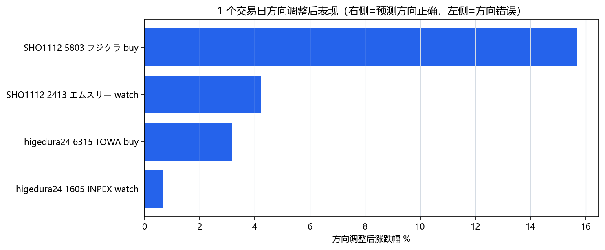
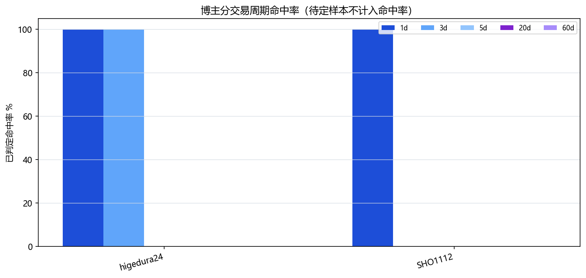

# 日股博主近一周总结

## 核心结论

- 本期共抓取 11 条素材，提取出 5 条结构化推荐意见，覆盖 4 只标的（フジクラ 5803、TOWA 6315、INPEX 1605、エムスリー 2413），全部来自 SHO1112 与 higedura24 两位日股博主；NaNaShuoMeiGu 的 3 条素材以美股宏观/FOMC 为主，未产出日股个股推荐。
- 方向上全部偏多：2 条明确 buy（フジクラ、TOWA），3 条 watch（フジクラ 押し目、INPEX 抄底、エムスリー 观察），未出现 sell / avoid。
- 已观察的短周期窗口全部跑赢基线：1d 全部成功，3d 在已成熟的两条上也全部成功；但 5d / 20d / 60d 全部 pending，目前还无法对中长线观点下结论。
- 综合分数最高的标的是 フジクラ（63，2 次提及）和 TOWA（55，单博主高 conviction）；这两只值得作为下周交易框架的重点观察对象。

## 按日期整理

- **2026-06-16｜higedura24｜TOWA (6315)｜buy / 中线**：解读为半导体后工序模封装设备世界龙头，全球份额 60%–70%，AI / HBM 需求拉动，2026 年 5 月发布的新机种 8 月起量产，财报跌停后股价正在逐步修复。
- **2026-06-17｜higedura24｜INPEX (1605)｜watch / 中线**：受中东停火影响股价急跌约 30%，PER 11 倍、PBR 0.79 倍、股息率约 3.3%，五期连续增配，イクシス LNG 每年约 500 亿日元利润贡献，定位为价值股逢低观察。
- **2026-06-18｜SHO1112｜フジクラ (5803)｜buy / 短波段**：业绩上修引发 PTS 涨停，K 线打到布林中轨与 25 日线后回落，结合上修预期判断有再评价空间。
- **2026-06-19｜SHO1112｜エムスリー (2413)｜watch / 短波段**：25 / 50 / 75 日线正在形成金叉，整体在震荡区间整理，下方关键支撑不能跌破，本人并未明确喊买。
- **2026-06-21｜SHO1112｜フジクラ (5803)｜watch / 短波段**：涨停后等量能消化 2–3 天，关注斐波那契 61.8% 回撤大约 6,375–6,400 日元附近的回踩机会，与政府"重点 17 项目"关联物色逻辑相呼应。

## 博主观点摘要

- **SHO1112（5 条素材，3 条意见）**：以日内 / 短波段技术派为主，关注 PTS、涨停后回踩、均线金叉、布林"バンド歩き"等结构。本期同一只标的（フジクラ）先 buy 后转 watch（涨停后等回踩），逻辑自洽。带有较强的会员引流和自我背书话术，需要剥离营销层后再看技术判断。
- **higedura24（3 条素材，2 条意见）**：偏中线基本面+龙头逻辑，本期两条意见都建立在"行业地位 + 估值 / 配息 + 催化"三段论上（TOWA 押半导体后工序龙头、INPEX 押 LNG 项目+连续增配价值股），相对克制，仅 INPEX 视频标题略带"何处可买"的钩子。
- **NaNaShuoMeiGu（3 条素材，0 条日股意见）**：3 条都是美股宏观叙事（FOMC、Warsh 首会、美伊停火、CTA 仓位），含较多 moomoo 平台推广，本期对日股个股没有可执行结论，归入宏观参考。

## 重点关注标的

- **フジクラ (5803)**：aggregate_score 63、被 SHO1112 在一周内提及 2 次，从 PTS 涨停后的追多转为押注 61.8% 回撤位（约 6,375–6,400 日元）的回踩。1d 已大幅跑赢（+15.69%），但博主自己也在 21 日转 watch 提示量能消化，框架上更适合"等回踩验证"，而不是无脑追高。
- **TOWA (6315)**：aggregate_score 55、higedura24 高信心（conviction 7）中线 buy，理由集中在后工序模封装全球份额 60%–70% 与 8 月新机种放量；1d/3d 已分别 +3.18% / +11.39%，短期跟随性强，但博主把它定位为中线，关键还要看 20d / 60d 是否兑现，目前 pending。
- **INPEX (1605)**：aggregate_score 24，higedura24 中线观察，价值股+配息+LNG 项目的组合逻辑，1d/3d 小幅跑赢（+0.68% / +1.56%），属于稳健型观察对象，节奏较慢，需等长周期验证。
- **エムスリー (2413)**：aggregate_score 11，SHO1112 明确说"不是买入"的 watch，仅作为均线金叉是否成立的跟踪对象；1d +4.21% 命中，但博主信心只有 4，不建议在缺乏后续验证前升级为买入。

## 简单回测

- **回测窗口口径**：1d / 3d / 5d / 20d / 60d 均按"实际交易日"数，跳过周末和假日；baseline 取预测日当日收盘（非交易日取最近一个交易日收盘）。buy / watch 类以股价上涨为命中，sell / avoid 类以下跌为命中（本期无 sell / avoid）；短线 / 未声明期限的意见要求 1d/3d/5d 至少两个窗口命中；中长线意见看 20d/60d，任一命中即算成功。
- **逐条命中情况**（仅解读 JSON 已计算结果）：
  - フジクラ 06-18 buy：1d +15.69% 命中；3d/5d 尚未成熟，opinion_status 仍 pending。
  - フジクラ 06-21 watch：当日为非交易日，baseline 取 06-19 收盘，1d/3d/5d 全部 pending，最新价持平于 baseline。
  - エムスリー 06-19 watch：1d +4.21% 命中，3d/5d pending。
  - INPEX 06-17 watch（中线）：1d +0.68%、3d +1.56% 均命中，但按规则中线看 20d/60d，目前两个窗口都 pending，结论尚未成立。
  - TOWA 06-16 buy（中线）：1d +3.18%、3d +11.39% 命中，20d/60d pending，同样无法直接判定中线成功。
- **creator_accuracy 解读**：
  - higedura24：2 条意见，全部为中长线，整体 overall 仍为 0/2/0（pending），1d 与 3d 上的判定窗口分别为 2/2、2/2，已成熟窗口命中率 100%，5d/20d/60d 全部 pending。
  - SHO1112：3 条意见，全部短线 / swing，overall 也是 0/3/0（pending），1d 已判定 2/2（命中率 100%，累计 66.67%，因还有 1 条 pending），3d/5d 尚未成熟。
  - 综合：在所有已成熟的判定窗口里全部为正向命中，零失败；但 5d/20d/60d 一律未成熟，目前的高命中率主要反映本周日股偏强的 beta，不应过度外推为博主个人 alpha。

## 回避与风险

- **方向单一**：本期 5 条意见全部偏多，没有 sell / avoid 也没有 mixed→bearish，组合层面缺少空头对冲；当前结论高度依赖大盘继续走高。
- **追高与营销话术**：SHO1112 的フジクラ buy 出现在 PTS 涨停后，evidence 中明显含证券公司经历背书和会员引流话术；他自己在 06-21 已经转为 watch 提示量能消化，提醒不要把 06-18 的 buy 单独抽出来当无条件追高信号。
- **中线观点过早下结论**：TOWA、INPEX 都是中线视角，按系统规则应看 20d/60d，目前仅 1d/3d 已知，必须等长周期窗口成熟再评估；不能用 3d +11.39% 的短期跟随就把它当作中线胜利。
- **字幕识别噪声**：原始字幕里出现"フィボナス""バンドク""情報使用性""5 连续の増廃"等明显错字（应是フィボナッチ、バンドウォーク、業績修正、5 期連続の増配），仅作为意译参考，价格与命中统计应以 JSON 数值为准。
- **数据完整度**：本期 opend_verified 全部为 false，last_price / volume / turnover 在 ticker / recommendation 层均为 null，价格信息只能依赖 yfinance 端 price_check 字段；如果后续要做仓位决策，需先把 OpenD 校验补上。

## 数据说明

- 数据生成时间：2026-06-22 14:05 JST，回溯窗口 168 小时（约一周）。
- 源条目 11 条，结构化推荐 5 条，extraction_status = ok，提取方法均为 llm_Claude，来源类型全部为 youtube_subtitle。
- 价格回测口径详见 price_check_note：baseline 为预测日收盘，非交易日顺延至前一交易日；1d/3d/5d/20d/60d 均为实际交易日窗口。
- opend_checked = false，全部标的均未做 OpenD 实时校验，本报告涉及的现价、成交量字段以 yfinance 拉取的 baseline / latest_price 为准，不做二次推算。
- 本文为基于公开博主内容的研究纪要，不构成投资建议，所有标的均需结合自身风控独立判断。

## 回测图表

第一张图使用“方向调整后表现”：buy/watch 取原始涨跌幅，sell/avoid 取反向涨跌幅。因此柱子在右侧表示预测方向正确，左侧表示方向错误；蓝色为已命中，灰色为未命中或待定。

## 观点明细

sell/avoid 按股价下跌为命中；buy/watch 按股价上涨为命中。1d/3d/5d/20d/60d 均指实际交易日，非交易日不计入。长期/中线观点优先等待 20d/60d，短期或未给出期限的观点按 1d/3d/5d，至少两个交易周期命中才算综合成功。

| 日期 | 博主 | 标的 | 措辞/期限 | 周期结果 | 综合 |
| --- | --- | --- | --- | --- | --- |
| 2026-06-21 | SHO1112 | JP.5803 フジクラ | 观察偏多 / 短期 | 1d:待定; 3d:待定; 5d:待定; 20d:待定; 60d:待定 | 待定 |
| 2026-06-19 | SHO1112 | JP.2413 エムスリー | 观察偏多 / 短期 | 1d:+4.21%/成功; 3d:待定; 5d:待定; 20d:待定; 60d:待定 | 待定 |
| 2026-06-18 | SHO1112 | JP.5803 フジクラ | 看多/买入 / 短期 | 1d:+15.69%/成功; 3d:待定; 5d:待定; 20d:待定; 60d:待定 | 待定 |
| 2026-06-17 | higedura24 | JP.1605 INPEX | 观察偏多 / 长期/中线 | 1d:+0.68%/成功; 3d:+1.56%/成功; 5d:待定; 20d:待定; 60d:待定 | 待定 |
| 2026-06-16 | higedura24 | JP.6315 TOWA | 看多/买入 / 长期/中线 | 1d:+3.18%/成功; 3d:+11.39%/成功; 5d:待定; 20d:待定; 60d:待定 | 待定 |

## 博主准确率总表

表内 `n/m` 表示成功数/已判定数；待定样本另列，不从分母里消失。所有周期都是实际交易日，综合列按观点期限规则累计。

| 博主 | 观点数 | 1d | 3d | 5d | 20d | 60d | 综合成功/待定/失败 |
| --- | ---: | --- | --- | --- | --- | --- | --- |
| higedura24 | 2 | 2/2 命中(100.0%)，待0，总2 | 2/2 命中(100.0%)，待0，总2 | 0/0，待2，总2 | 0/0，待2，总2 | 0/0，待2，总2 | 0/2/0，累计成功 0/2 |
| SHO1112 | 3 | 2/2 命中(100.0%)，待1，总3 | 0/0，待3，总3 | 0/0，待3，总3 | 0/0，待3，总3 | 0/0，待3，总3 | 0/3/0，累计成功 0/3 |
